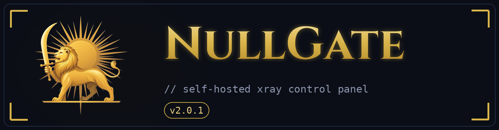

<div align="center">



<br><br>

[](https://github.com/XTLS/Xray-core)
[](https://railway.app)
[]()
[]()
[]()

**NullGate** یک سرویس مبتنی بر **Xray-core** با پنل وب فارسی، لینک اشتراک (Subscription)، پشتیبانی از **TCP Proxy** ریلوی و لوگوی شیر و خورشید است. نسخه **2.0.0** یک ارتقای بزرگ بود (QR کد، پشتیبان‌گیری/بازیابی، مدیریت پروتکل‌ها، لاگ زنده، کانفیگ JSON بهینه) و نسخه **2.0.1** هویت بصری را کامل می‌کند: پرچم اصیل شیر و خورشید در تمام پنل و لوگوی اصلاح‌شده با شمشیر در دست شیر.

</div>

> [!IMPORTANT]
> این پروژه صرفاً برای استفاده شخصی طراحی شده است.

---


## معماری

```
کلاینت ──HTTPS──▶ Railway ──▶ nginx (PORT)
                               ├─ /ws       → VLESS · WebSocket
                               ├─ /xhttp    → VLESS · XHTTP (packet-up)
                               ├─ /hu       → VLESS · HTTPUpgrade
                               ├─ /vmess    → VMess · WebSocket
                               ├─ /trojan   → Trojan · WebSocket
                               ├─ /panel    → پنل مدیریت
                               ├─ /sub/...  → لینک اشتراک
                               └─ /         → index.html (صفحه ظاهری)

کلاینت ──TCP──▶ Railway TCP Proxy ──▶ Xray (VLESS · Reality) روی پورت 9000
```

> **چرا XHTTP قبلاً کار نمی‌کرد؟** مسیر XHTTP برای هر اتصال زیرمسیر می‌سازد (`/xhttp/<id>/<n>`) ولی fallback خود Xray فقط مسیر دقیق را تطبیق می‌دهد. حالا nginx بر اساس **پیشوند مسیر** جدا می‌کند و حالت `packet-up` (سازگار با پروکسی‌های HTTP) استفاده می‌شود.

## تغییرات نسخه 2.0.1

- **پرچم اصیل شیر و خورشید در تمام پنل** — پس‌زمینه صفحه ورود (پرچم موج‌دار روی تاریک پرسپولیس) و بنر داشبورد (پرچم روی تمام‌نمای تهران) با پرچم شیر و خورشید بازسازی شد
- **لوگوی اصلاح‌شده** — نشان شیر و خورشید اکنون شمشیر را در دست بالاکشیده خود دارد (مطابق نشان اصیل قاجاری)
- رفع باگ نمایش گزارشات (مقدار صفر و نمودار خالی بعد از ورود)

## امکانات نسخه 2.0.0

- **QR کد** برای لینک ساب و تک‌تک کانفیگ‌ها (ساخت شده داخل خود پنل، بدون سرویس بیرونی)
- **کانفیگ JSON بهینه** برای هر کاربر: مسدودسازی تبلیغات (`geosite:category-ads-all`)، عبور مستقیم سایت‌های ایرانی (`geosite:category-ir` + `geoip:ir`)، DoH و mux غیرفعال برای XHTTP/Vision
- **کانفیگ‌های بهینه‌تر**: early-data با `?ed=2048` روی همه WebSocket ها (server + client)، `spx=/` برای Reality، policy تیون‌شده (handshake 4s، bufferSize 256) و `tcpNoDelay` روی خروجی
- **پروتکل‌های قابل خاموش/روشن**: سراسری در تنظیمات + استثنا برای هر کاربر (اینباند خاموش اصلاً بالا نمی‌آید)
- **پشتیبان‌گیری و بازیابی کامل** با یک فایل JSON (بدون رمز پنل)
- **عملیات گروهی کاربران**: انتخاب با چک‌باکس → تمدید / صفر کردن مصرف / حذف
- **مدیریت کامل کاربر**: تغییر نام، یادداشت مدیر، بازتولید UUID، QR، JSON
- **لاگ زنده Xray** (۱۵۰ خط آخر) و **بررسی سلامت سرویس** با تاخیر واقعی API
- **دانلود پیکربندی سرور** و پشتیبان از همان تنظیمات
- **گزارش دونات مصرف** ۵ کاربر برتر، هشدار «انقضای نزدیک» در داشبورد
- **تنظیمات بیشتر**: مدت نشست ورود (۱ تا ۳۳۶ ساعت) + فرمت نام کانفیگ (از نسخه قبلی)
- **امنیت**: تاخیر عمدی روی ورود ناموفق، ابطال نشست‌ها بعد از تغییر رمز، سربرگ اشتراک دقیق‌تر

## فایل‌ها (همه در ریشه ریپو)

`Dockerfile` · `panel.py` · `panel.html` · `index.html` · `README.md` · `LICENSE` · `nullgate-logo.png` · `nullgate-logo.svg` · `nullgate-icon.svg`

## راه‌اندازی

1. هر ۵ فایل را در یک ریپوی GitHub بگذارید.
2. Railway: `New Project → Deploy from GitHub repo`.
3. در **Variables** این‌ها را بگذارید:

| نام | مقدار | توضیح |
|---|---|---|
| `PORT` | `8080` | پورت HTTP سرویس |
| `UUID` | یک UUID ثابت | **حتماً بگذارید** تا لینک اشتراک و کلید Reality با هر دیپلوی عوض نشود |
| `ADMIN_USER` | `admin` | نام کاربری پنل |
| `ADMIN_PASSWORD` | رمز دلخواه | خالی باشد، رمز همان `UUID` است |
| `DOMAIN` | *(اختیاری)* | اگر دامنه اختصاصی دارید |

4. `Settings → Networking → Generate Domain` با Target Port برابر `8080`.
5. (پیشنهادی) `Settings → Volumes` با مسیر `/data` تا کاربران و تنظیمات پاک نشوند.
6. پنل: `https://<دامنه>/panel`

## لینک اشتراک (Sub)

در تب **کاربران**، دکمه «کپی ساب» را بزنید و لینک را در کلاینت به‌عنوان Subscription اضافه کنید:

- **v2rayNG**: منو → Subscription group setting → + → لینک را بچسبانید → Update subscription
- **Hiddify / Streisand / V2Box**: افزودن پروفایل از کلیپ‌بورد

با یک لینک، همه پروتکل‌ها (WS، XHTTP، HTTPUpgrade، VMess، Trojan و Reality) یکجا وارد می‌شوند. توکن هر کاربر از `UUID` ساخته می‌شود و با دیپلوی دوباره ثابت می‌ماند.

## فعال‌کردن TCP Proxy

1. Railway → سرویس → `Settings → Networking → TCP Proxy`
2. پورت را **9000** بگذارید.
3. سرویس را یک‌بار Redeploy کنید.

ریلوی خودش متغیرهای `RAILWAY_TCP_PROXY_DOMAIN` و `RAILWAY_TCP_PROXY_PORT` را می‌سازد و پنل آن‌ها را می‌خواند؛ لینک **VLESS · Reality** به‌صورت خودکار به لینک‌ها و ساب اضافه می‌شود. اگر پورت دیگری بخواهید، همان را در Railway و در متغیر `TCP_APP_PORT` بگذارید.

## متغیرهای اختیاری

`WS_PATH` `XHTTP_PATH` `HU_PATH` `VMESS_PATH` `TROJAN_PATH` · `SECRET` (منبع توکن‌ها؛ پیش‌فرض `UUID`) · `TCP_HOST` / `TCP_PORT` (اگر TCP Proxy را با دامنه خودتان CNAME کرده‌اید) · `REALITY_PRIVATE_KEY` / `REALITY_SHORT_ID`

## نکات

- با ساخت یا حذف کاربر، Xray چند ثانیه ری‌استارت می‌شود.
- ترافیک کاربران به شبکه خصوصی Railway (`*.railway.internal`) و آدرس‌های داخلی مسدود است.
- اگر XHTTP روی کلاینتی وصل نشد، همان کلاینت را به‌روز کنید یا موقتاً از WS / HTTPUpgrade استفاده کنید.
- در لاگ Railway، خروجی `nginx -t` و پیام‌های Xray دیده می‌شود.
- پلن رایگان Railway سقف مصرف دارد.
